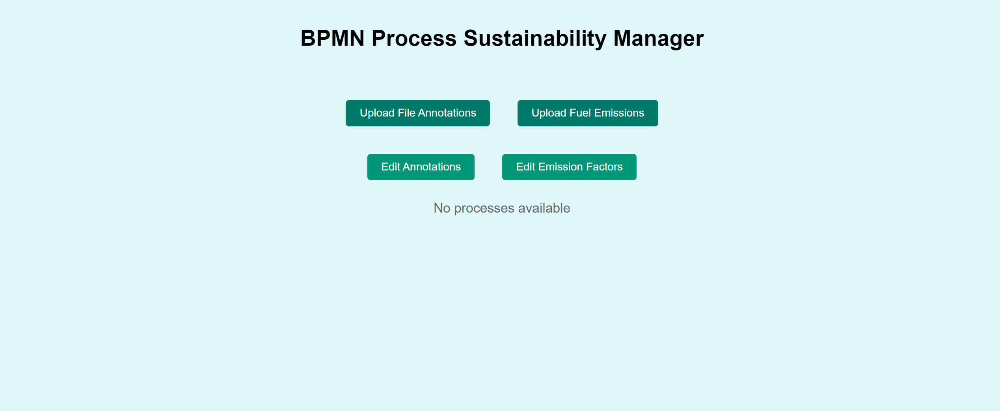
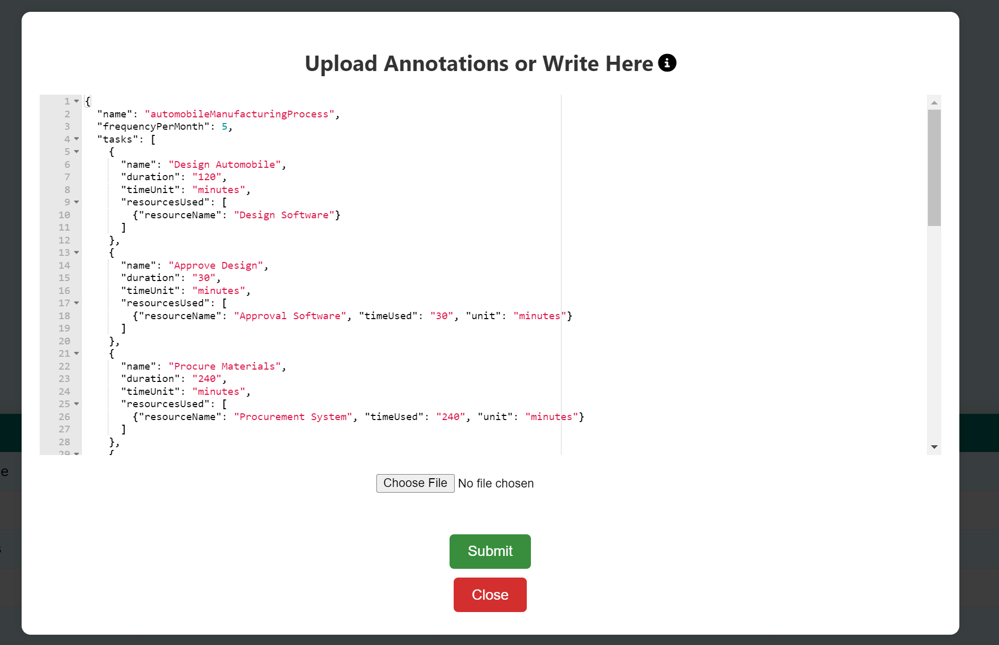
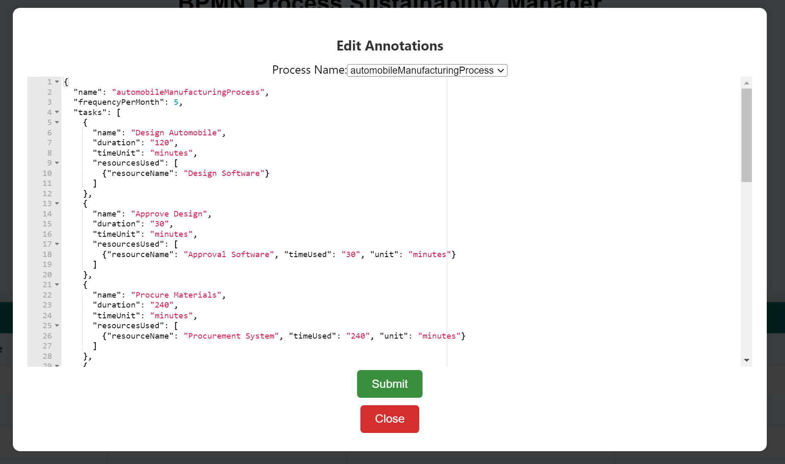
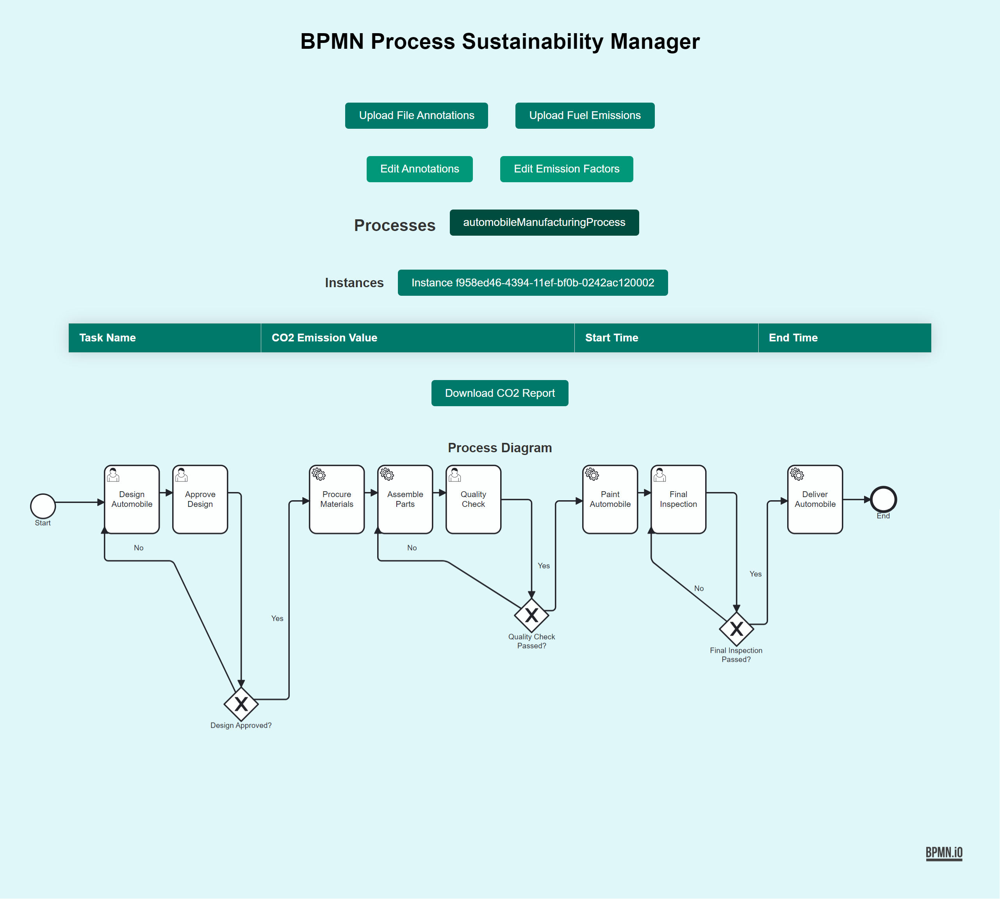
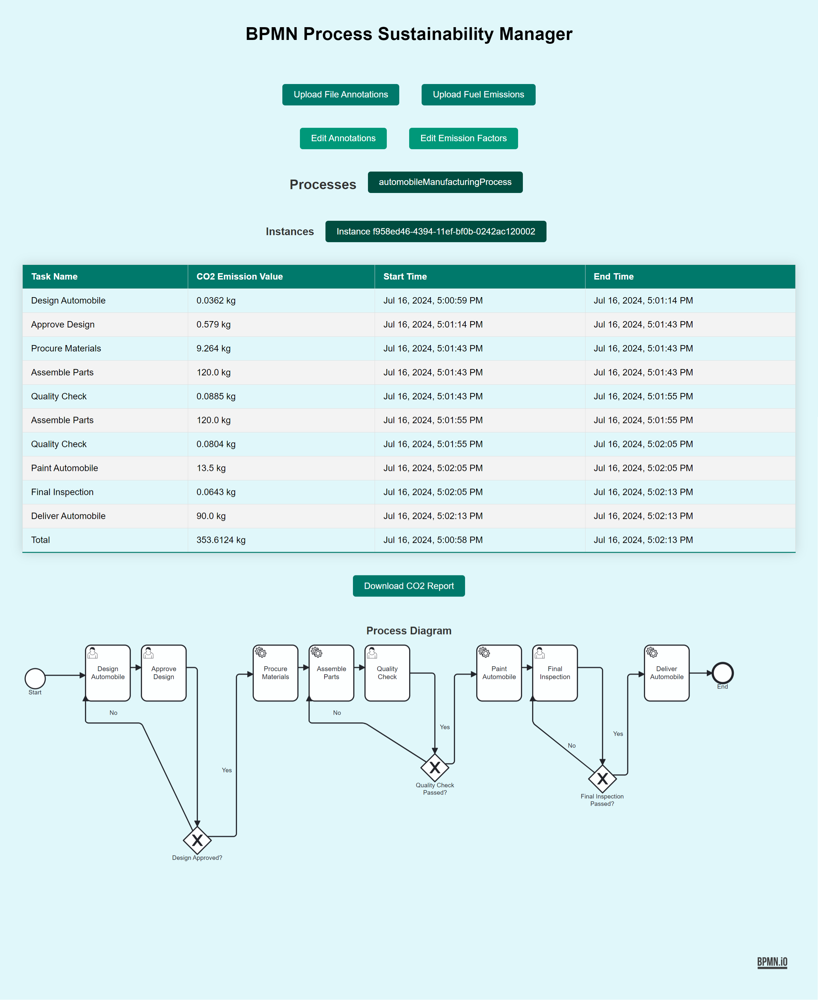
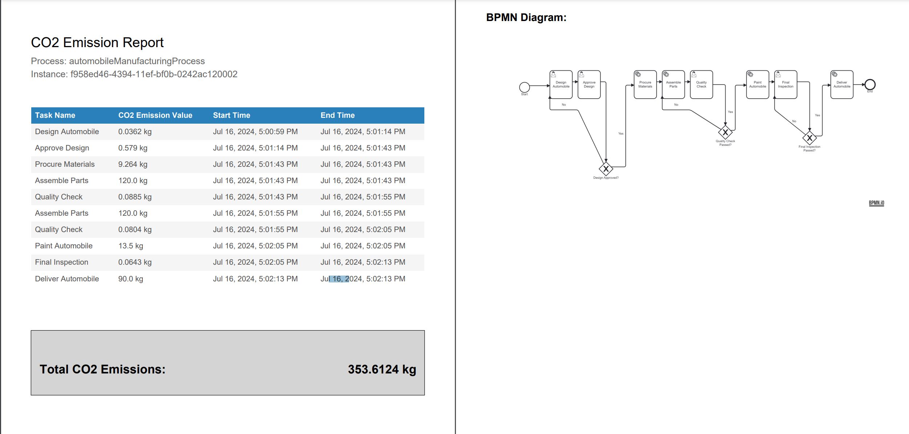

# Sustainability Calculator for Business Process Management (BPM)

### Overview 
This repository contains the implementation of a Sustainability Calculator designed to integrate with Business Process Management (BPM) systems. The calculator focuses on accurately calculating and monitoring CO2 emissions across various business processes, supporting sustainability initiatives within organizations.

The project is part of a thesis that explores the integration of sustainability into BPM, highlighting the need for tools that manage and assess the environmental footprint of business operations effectively.

### Features
 - CO2 Emission Calculation: The calculator estimates CO2 emissions using emission factors that can be customized by the user to match specific business requirements. The calculations ensure consistency and accuracy across various activities and resources.

 - Real-Time Emission Tracking: The system processes data in real-time, providing immediate feedback on emission levels during business process execution. This feature is essential for ongoing monitoring and timely decision-making.

 - Modular Architecture: The system's architecture supports scalability and adaptability. It is designed using containers and decoupled components, allowing for easy extension and horizontal/vertical scaling.

 - Integration with BPM Engines: The sustainability calculator currently integrates with Camunda 7 and JBPM, two widely used BPM engines. The system is designed to be versatile, supporting potential integration with additional BPM engines.

 - User-Friendly Dashboard: Developed using React, the dashboard allows users to upload, edit, and visualize annotations and emission factors. It provides an intuitive interface for managing sustainability data and accessing real-time emission reports.

### Requirements
#### Functional Requirements
 - Integration with BPM Engines: Support for Camunda 7 and JBPM to facilitate communication and real-time monitoring.
 - Real-Time Data Processing: Use of Stomp WebSockets for real-time data communication.
 - Data Management: Reliable storage and management of process details, annotations, and emission factors using PostgreSQL.
 - Emission Calculation: Accurate CO2 emission calculations using predefined emission factors.
#### Non-Functional Requirements
 - Scalability: The system is designed to handle increased loads and integrate new features easily.
 - Usability: The dashboard provides an intuitive interface, enhancing user interaction and accessibility.
 - Maintainability: The modular architecture ensures ease of maintenance and extensibility.
 - Portability: Use of Docker for deployment across various operating systems.
 - Reliability and Data Integrity: Validation and error handling mechanisms ensure accurate and consistent data for sustainability calculations.

### Limitations
 - Data Precision: The accuracy of emission calculations depends on the precision of the input data. Incomplete or inaccurate data may lead to unreliable results.
 - Limited Resource Types: Currently, only atomic resources are considered in the emission calculations. Shared resources are not yet supported.
 - BPM Engine Compatibility: The system supports only Camunda 7 and JBPM. Other BPM engines are not yet integrated.
 - Scalability Challenges: Handling large volumes of data and extensive business processes may require additional computational resources to maintain performance.

### Future Work
 - Shared Resource Integration: Introduce shared resources in emission calculations for a more comprehensive assessment.
 - Extended BPM Engine Support: Add compatibility with other BPM engines, including Camunda 8 and IBM BPM.
 - Enhanced Use Cases: Enable process execution from the dashboard for testing configurations and real-time process flow manipulation based on emission levels. 
 - Extended Emission Types: Include other greenhouse gas (GHG) emissions, such as methane and nitrous oxide, in the sustainability calculations.

#### Camunda 8
Camunda 7 was chosen for this project because the event driven microservice architecture of Camunda 8 posed issues for setting up the event listeners. In the future, Camunda 8 can be integrated by setting up the Camunda Exporter (that replaced the event listeners), or by using the zeebee worker environment to replicate the event listener inside the task execution step. For the latter step, the functionality is already implemented, but it is not in use, as the scope of the project was to implement a decoupled monitoring tool and modifications inside the task execution process were not wanted.

In the camunda-integration module the functionality for using the zeebee engine is commented but it can be easily used by running a camunda 8 process instance from the camunda modeler and using the docker-compose-camunda.yaml file inside the docker build script.
#### Dashboard process execution
In order to Enable process execution from the dashboard for testing configurations, the process forms and diagram need to be imported to the engine integration module, and the module needs to be connected to the engine to be able to use method calls or HTTP requests to deploy the files and execute processes. Most of this functionality is already implemented and part of the code-base, but it is not in function. It involves file transfers by a shared docker volume for Camunda, and runtime deployed updated KJar for JBPM. 

The functionality is inside the main application and the engine integration modules, the latter being built with this specific scope in mind. At the moment their only functionality is channel communication, and they could have been replaced by just communication between the engine and main application module. 
### Project components

- Business Process Management (BPM) Engines: This component is a running BPMN execution engine that is used for executing the business processes that need to be verified. As the system is compatible with multiple BPM engines, a corresponding integration will be used for communication between the BPM engine and the other modules. The engine itself utilizes event listeners to notify the system of process events such as process start, process end, activity start, and activity end
- Integration Modules: For each BPM engine, there is a dedicated integration module that acts as an intermediary between the main application and the BPM engines. These modules facilitate seamless communication and data exchange.
- Main Application: This component contains the core business logic of the system. It performs the majority of computational tasks, including emission calculations, and handles data management by using a database to persist data. Additionally, it ensures real-time communication with the front end, enabling users to accurately visualize carbon emissions.
- Front End: The front end manages the user dashboard, serving as the interface for system users. It allows users to upload fuel annotations files and fuel emission values, and provides a real-time view of the carbon emissions data.
- Database: The database is used by the main application to store and manage all relevant data, including process information and emissions calculations.

### Setup
 - Clone the project
 - Open the project in your chosen IDE compatible with Spring
 - Build all Gradle dependencies
 - In order to run in a containerized environment, make sure Docker is running, before running the *docker-build.sh script*. The script has 1 argument, representing the docker compose profile wanted. There are 2 profiles: camunda and jbpm.
 - If the script ran without any issues the frontend dashboard located at http://localhost:3000 should look like this:

 - For uploading/editing annotations and fuel emission factors, use the buttons present in the dashboard. Modals will pop up for either uploading a file or writing the json.
 
 
 - For integrating Camunda, you can use a locally running Camunda Modeler to build the BPMN model. When done with setting up the model, you can deploy it on http://localhost:8080/engine-rest, along with any forms, and then run it from the modeler. Any user task can be filled at http://localhost:8080/camunda/app/tasklist/default.
 - For JBPM, the docker compose script uploads a KJAR on the JBPM server. The KJAR contains the BPMN diagram and the linked forms. After the containers are running, use Swagger located at http://localhost:8080/kie-server/docs to create the container. use the following payload: {
   "container-id" : $container-name,
   "release-id" : {
   "group-id" : "org.tests.processes",
   "artifact-id" : "jbpm-processeventlistener",
   "version" : "0.1.0-SNAPSHOT"
   }
   }. Then you can either create a process instance through the jbpm server console at http://localhost:8080/business-central (wbadmin:wbadmin) or through swagger, using your process id. 
 - Run your process instance from the engine. After the first task has been executed, new buttons for the current process and the running process instance will appear, along with the process diagram. The dashboard should look like this:
 
 - Select the desired process instance and see each executed activity's Co2 emissions. The emissions per activity appear after the activity has been executed end the activity end event fired. The emissions for user activities are shown after the form was claimed, filled and submitted. After the process ended, the total co2 amount is shown.
 
 - You can download the report using the download report button
 

### Running the project locally

In order to run the project locally, you can replace the endpoint urls to localhost inside the application.properties files in each component. Take note that this only works with camunda, as jbpm server is still ran as a container and cannot point to your localhost. Make sure to replace rabbitmq as well as the postgres db.

